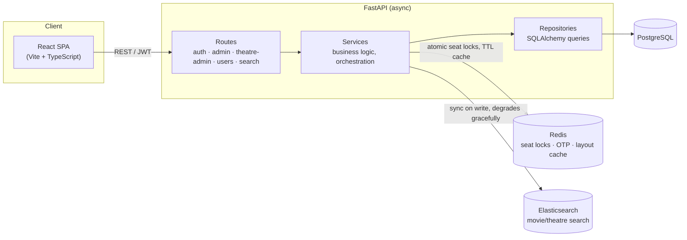

# BookYourShow


A full-stack movie ticket booking platform — a BookMyShow-style app with real-time seat locking under concurrent load, role-based access control, and a React customer app on top of an async FastAPI backend.

## Why this project

Booking systems live or die on one hard problem: **two people must never be sold the same seat.** This project solves it with layered concurrency control (Redis atomic locks + a database-level partial unique constraint) and has an actual load test proving it — 200 concurrent users hammering the same show, zero double-bookings.

Beyond that core problem, it's a complete, working product: OTP + Google OAuth login, seat-map rendering with live lock/availability state, a booking history and cancellation flow, and a CI pipeline that runs the full backend and frontend test suites on every push.

## Features

- **Real-time seat locking** — Redis atomic `HSETNX` prevents two users from locking the same seat; a partial unique DB index (`WHERE NOT is_cancelled`) is the final backstop against double-booking, even under a race
- **JWT + OTP authentication** — passwordless login via email OTP, Google OAuth (token handoff via URL fragment, never logged or query-stringed), refresh token rotation
- **RBAC** — `admin` / `theatre_admin` / `user` roles enforced via FastAPI permission dependencies on every mutating route
- **Full-text search** — Elasticsearch-backed movie/theatre search with auto-sync on writes and graceful degradation if ES is unreachable
- **Seat layout caching** — Redis-backed layout with DB fallback and a live lock/booked-status overlay
- **Show scheduling** — overlap detection, per-category pricing, ownership verification so a theatre admin can only touch their own venues
- **React customer app** — browse, seat selection with a 10-minute lock countdown, booking, booking history, cancellation, and profile — talking to the API over a typed client with automatic token refresh
- **Load tested** — 200 concurrent users, 9,400+ requests, zero double-bookings verified (see `load_tests/`)
- **CI on every push** — backend test suite + frontend type-check/test/build, both required to pass

## Tech Stack

| Layer | Technology |
|-------|-----------|
| Backend framework | FastAPI (async) |
| Frontend | React 19, Vite, TypeScript, Tailwind CSS |
| Frontend state | TanStack Query (server state), Zustand (session state) |
| Database | PostgreSQL 16 + SQLAlchemy 2.0 (async) |
| Cache / Locking | Redis |
| Search | Elasticsearch 9.x |
| Migrations | Alembic |
| Auth | JWT (python-jose) + OTP via Redis, Google OAuth |
| Containerization | Docker + Docker Compose |
| CI | GitHub Actions |
| Backend tests | pytest, pytest-asyncio |
| Frontend tests | Vitest, React Testing Library |
| Package managers | uv (Python), npm (frontend) |

## Architecture



See [docs/architecture.md](docs/architecture.md) for the seat-locking sequence, auth flows, and database schema in more detail.

## Quick Start

### With Docker (recommended)

Runs the full stack: API, frontend, PostgreSQL, Redis, and Elasticsearch.

```bash
git clone https://github.com/Hemanshu007/BookYourShow.git
cd BookYourShow

# Backend + infra env
cp .env.docker.example .env.docker
# edit .env.docker with real secrets (JWT keys, Google OAuth, SMTP, OMDB API key)

docker compose up --build -d

# Run migrations
docker compose exec api uv run alembic upgrade head

# Seed roles, permissions, and test users
cat seed_db.sql | docker exec -i postgres_container psql -U postgres -d booking_dev
```

- API: `http://localhost:8000` (interactive docs at `/docs`)
- Frontend: `http://localhost:5173`

### Without Docker

**Backend:**
```bash
cp .env.example .env
# edit .env with your PostgreSQL, Redis, and Elasticsearch connection details

uv sync
uv run alembic upgrade head
uv run fastapi dev app/main.py
```

**Frontend:**
```bash
cd frontend
cp .env.example .env
# edit VITE_API_BASE_URL if your backend isn't on the default port

npm install
npm run dev
```

## API Reference

Full interactive docs are auto-generated at `/docs` (Swagger UI) once the API is running. Summary of the surface:

<details>
<summary><strong>Auth</strong></summary>

| Method | Endpoint | Description |
|--------|----------|-------------|
| POST | `/api/v1/auth/send-otp` | Send a login OTP to an email |
| POST | `/api/v1/auth/signin` | Verify OTP, sign in or create the user |
| POST | `/api/v1/auth/refresh-token` | Exchange a refresh token for a new pair |
| GET | `/api/v1/auth/google/login` | Redirect to Google's consent screen |
| GET | `/api/v1/auth/google/callback` | Google OAuth callback → redirects to frontend with tokens |

</details>

<details>
<summary><strong>Users (customer-facing)</strong></summary>

| Method | Endpoint | Auth | Description |
|--------|----------|------|-------------|
| GET | `/api/v1/users/me` | User | Current user's profile |
| GET | `/api/v1/users/movies` | — | Paginated movie catalog |
| GET | `/api/v1/users/theatre/{id}/movies` | — | Movies playing at a theatre |
| GET | `/api/v1/users/movie/{id}/theatres` | — | Theatres screening a movie |
| GET | `/api/v1/users/theatre/{id}/movie/{id}` | — | Shows for a movie at a theatre |
| GET | `/api/v1/users/show/{id}` | — | Show details + seat layout |
| POST | `/api/v1/users/show/{id}/seat-lock` | User | Lock selected seats (10-min TTL) |
| POST | `/api/v1/users/show/{id}/seat-book` | User | Book locked seats |
| GET | `/api/v1/users/bookings` | User | Booking history |
| GET | `/api/v1/users/booking/{id}` | User | Booking detail (seats, price, show info) |
| POST | `/api/v1/users/booking/{id}/cancel` | User | Cancel a booking |
| DELETE | `/api/v1/users/user/delete` | User | Delete own account |

</details>

<details>
<summary><strong>Theatre Admin</strong></summary>

| Method | Endpoint | Description |
|--------|----------|-------------|
| POST | `/api/v1/theatre-admin/create-layout` | Define a seat layout |
| POST | `/api/v1/theatre-admin/create-screen` | Add a screen to a theatre |
| POST | `/api/v1/theatre-admin/create-show` | Schedule a show with category pricing |
| GET | `/api/v1/theatre-admin/my-theatres` | Theatres owned by the current operator |
| GET | `/api/v1/theatre-admin/my-screens` | Screens across the operator's theatres |
| DELETE | `/api/v1/theatre-admin/screen/delete/{id}` | Remove a screen |
| DELETE | `/api/v1/theatre-admin/show/delete/{id}` | Remove a show |
| POST | `/api/v1/theatre-admin/verify-ticket` | Verify a ticket's QR hash at the door |

</details>

<details>
<summary><strong>Admin</strong></summary>

| Method | Endpoint | Description |
|--------|----------|-------------|
| POST | `/api/v1/admin/create-user` | Create a user with a specific role |
| POST | `/api/v1/admin/create-theatre` | Register a theatre and assign an operator |
| POST | `/api/v1/admin/create-movie` | Add a movie by IMDB ID (fetched from OMDB) |
| GET | `/api/v1/admin/users` \| `/theatres` \| `/movies` | Paginated listings |
| DELETE | `/api/v1/admin/theatre/delete/{id}` \| `/movie/delete/{id}` | Soft-delete |

</details>

<details>
<summary><strong>Search</strong></summary>

| Method | Endpoint | Description |
|--------|----------|-------------|
| GET | `/api/v1/search/?q=...` | Search movies and theatres by name |

</details>

## Project Structure

```
app/
├── api/v1/            # Route handlers
├── core/               # Config, Redis, Elasticsearch config
├── db/                 # Async engine + session
├── middlewares/        # Rate limiting, global exception handling
├── models/             # SQLAlchemy models (15 tables)
├── repositories/       # Database operations
├── schemas/            # Pydantic request/response models
├── services/           # Business logic (auth, booking, search, email)
└── utils/              # JWT, encryption, seat-layout helpers

frontend/
├── src/api/            # Typed API client (one module per resource)
├── src/components/     # SeatGrid, cards, layout, error boundary
├── src/hooks/          # useAuth, useCountdown
├── src/pages/          # One per route
└── src/stores/         # Zustand auth store

tests/                  # Backend: unit, integration, concurrency, edge cases
load_tests/             # Locust load test suite (200-user contention test)
alembic/                # Database migrations
.github/workflows/      # CI: backend tests + frontend type-check/test/build
```

## Testing

**Backend:**
```bash
uv run pytest tests/ -v
```

**Frontend:**
```bash
cd frontend
npm run test
npx tsc --noEmit
```

**Load test** (requires a running server):
```bash
uv run python load_tests/seed.py
uv run python -m locust -f load_tests/locustfile.py --host http://localhost:8000 --headless -u 200 -r 20 --run-time 60s
uv run python load_tests/verify.py
```

Both suites run automatically in CI on every push — see the badge at the top of this file.

## License

[MIT](LICENSE)
